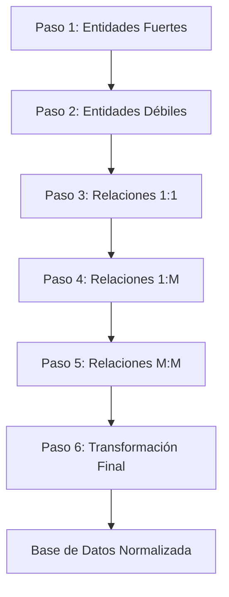

🌐 **Idiomas:** 🇺🇸 [English](README.md) | 🇪🇸 Español


# Cómo modelar correctamente bases de datos relacionales

Esta guía explica un método simple para diseñar bases de datos relacionales para **proyectos académicos y sistemas pequeños o medianos**.

El objetivo es evitar redundancia, mantener consistencia y producir estructuras de bases de datos limpias.

Este documento fue creado originalmente para un **concurso universitario de diseño de bases de datos**.

---

---

## Tabla de Contenidos

* [Algoritmo de los 6 Pasos](#algoritmo-de-seis-pasos)
* [Formas Normales](#formas-normales)

  * [Primera Forma Normal (1NF)](#primera-forma-normal-1nf)
  * [Segunda Forma Normal (2NF)](#segunda-forma-normal-2nf)
  * [Tercera Forma Normal (3NF)](#tercera-forma-normal-3nf)
* [Errores Comunes en el Diseño de Bases de Datos](#errores-comunes-en-el-diseño-de-bases-de-datos)
* [Contribuir](#contribuir)

---

# Algoritmo de los 6 Pasos



*Aplicar después del modelado Entidad-Relación.*

### Paso 1 – Entidades Fuertes

Crear tablas para todas las entidades fuertes.

### Paso 2 – Entidades Débiles

Crear tablas para las entidades débiles que dependen de su entidad propietaria.

A partir del paso 3, las tablas comienzan a relacionarse entre sí y a recibir llaves foráneas.

**NOTA:** Nunca marcar PK o FK en el diagrama E-R.

### Paso 3 – Relaciones 1:1

Analizar qué tabla debe contener la llave foránea.

### Paso 4 – Relaciones 1:M

La tabla del **lado muchos** recibe la llave foránea de la tabla del **lado uno**.

### Paso 5 – Relaciones M:M

Crear una nueva tabla que incluya la llave primaria de cada una de las tablas relacionadas.

Es válido que esta tabla contenga únicamente las dos llaves foráneas.

### Paso 6 – Transformación Final

En este punto las tablas deben estar correctamente relacionadas.

Si el algoritmo fue aplicado correctamente, la base de datos debería evitar redundancia y complejidad innecesaria mientras mantiene la consistencia de los datos.

---

# Formas Normales

*No es necesario aplicarlas si el algoritmo ya fue utilizado.*

## Primera Forma Normal (1NF)

Eliminar valores repetidos.

Cada columna debe almacenar **un solo valor**.

Incorrecto:

| Fecha_Cita | Tratamientos                     |
| ---------- | -------------------------------- |
| 02/14/2024 | Ortodoncia, Limpieza, Endodoncia |

Correcto:

| Fecha_Cita | Tratamientos |
| ---------- | ------------ |
| 02/14/2024 | Ortodoncia   |
| 02/14/2024 | Limpieza     |
| 02/14/2024 | Endodoncia   |

---

## Segunda Forma Normal (2NF)

Requiere cumplir primero la 1NF.

Eliminar dependencias parciales.

Desde el punto de vista de memoria y de buenas prácticas de diseño, es mejor almacenar **llaves foráneas con IDs en lugar de descripciones**.

Incorrecto:

| ID_Cita | Paciente           | Doctor    | Fecha_Cita | Tratamiento    |
| ------- | ------------------ | --------- | ---------- | -------------- |
| 1       | Fernando Flores    | Dr. López | 02/14/2024 | Ortodoncia     |
| 2       | Ash Ketchum        | Dr. López | 04/15/2025 | Blanqueamiento |
| 3       | Charmander Sánchez | Dr. Villa | 01/05/2023 | Endodoncia     |

Correcto:

| ID_Cita | Id_Paciente | Id_Doctor | Fecha_Cita | Id_Tratamiento |
| ------- | ----------- | --------- | ---------- | -------------- |
| 1       | 3           | 2         | 02/14/2024 | 7              |
| 2       | 6           | 2         | 02/14/2024 | 21             |
| 3       | 10          | 15        | 02/14/2024 | 2              |

---

## Tercera Forma Normal (3NF)

Un atributo que no es clave no debe depender de otro atributo que tampoco es clave.

Los atributos deben depender **solo de la clave primaria**.

Correcto:

| EstudianteID | CursoID |
| ------------ | ------- |
| 1            | C1      |
| 2            | C2      |

Incorrecto:

| EstudianteID | CursoID | Profesor |
| ------------ | ------- | -------- |
| 1            | C1      | López    |
| 2            | C2      | Ramírez  |

Esto rompe la 3NF porque **Profesor depende de Curso y no necesariamente de Estudiante**.

---

La cuarta y quinta forma normal aplican en casos más complejos que involucran dependencias multivaluadas o dependencias de unión.

Para la mayoría de los sistemas, llegar a **3NF es suficiente para obtener una base de datos bien diseñada**.

---

---

# Errores Comunes en el Diseño de Bases de Datos

## 1. Usar nombres vagos o inconsistentes

Mal:

UserTable
tbl_users
users_data

Bien:

User
Product
Order

Las tablas y columnas deben seguir **convenciones de nombres consistentes**.

---

## 2. Usar nombres en singular o plural de forma inconsistente

Mal:

```text
User
Products
orders
```

Bien:

```text
User
Product
Order
```

Preferiblemente, utiliza **nombres en singular** para las tablas, ya que cada fila (tupla) representa una instancia de esa entidad.

Si se decide utilizar nombres en plural, también es válido, pero **debe mantenerse la misma convención en toda la base de datos**.

> Lo importante no es tanto elegir singular o plural, sino mantener una convención consistente.

---

## 3. Usar datos naturales como llaves primarias

Incorrecto:

Usar el email como llave primaria.

Correcto:

UserID (llave primaria entera)

Los datos naturales pueden cambiar, pero los IDs permanecen estables.

---

## 4. Crear tablas que intentan representar múltiples entidades

Ejemplo:

EmployeeCustomer

Esto indica que dos entidades diferentes fueron mezcladas en una sola tabla.

Las entidades deben representar **un solo concepto del mundo real**.

---

## 5. Diseñar tablas sin entender primero el dominio

Una base de datos no debería diseñarse solamente a partir del código de la aplicación.

Primero se debe entender:

• entidades
• relaciones
• restricciones

Después se crean las tablas.

---

## 6. Ignorar consideraciones de indexación

Incluso tablas bien diseñadas pueden volverse lentas sin índices adecuados.

Las llaves primarias y los campos que se consultan con frecuencia deberían estar indexados.

# Contribuir

Las contribuciones son bienvenidas.

Si encuentras errores, mejoras o ejemplos mejores,
puedes abrir un Issue o enviar un Pull Request.
