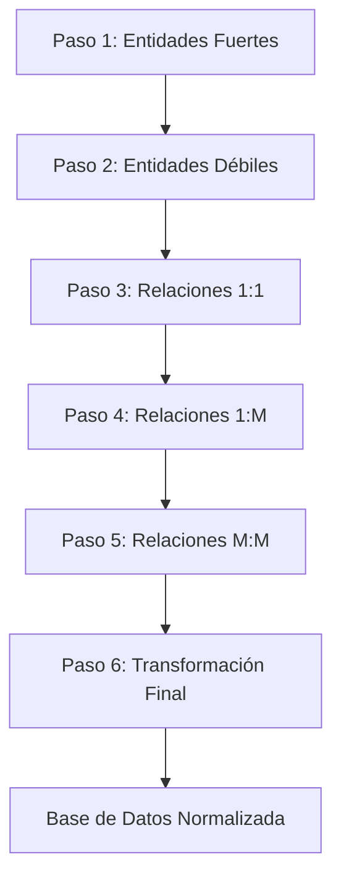
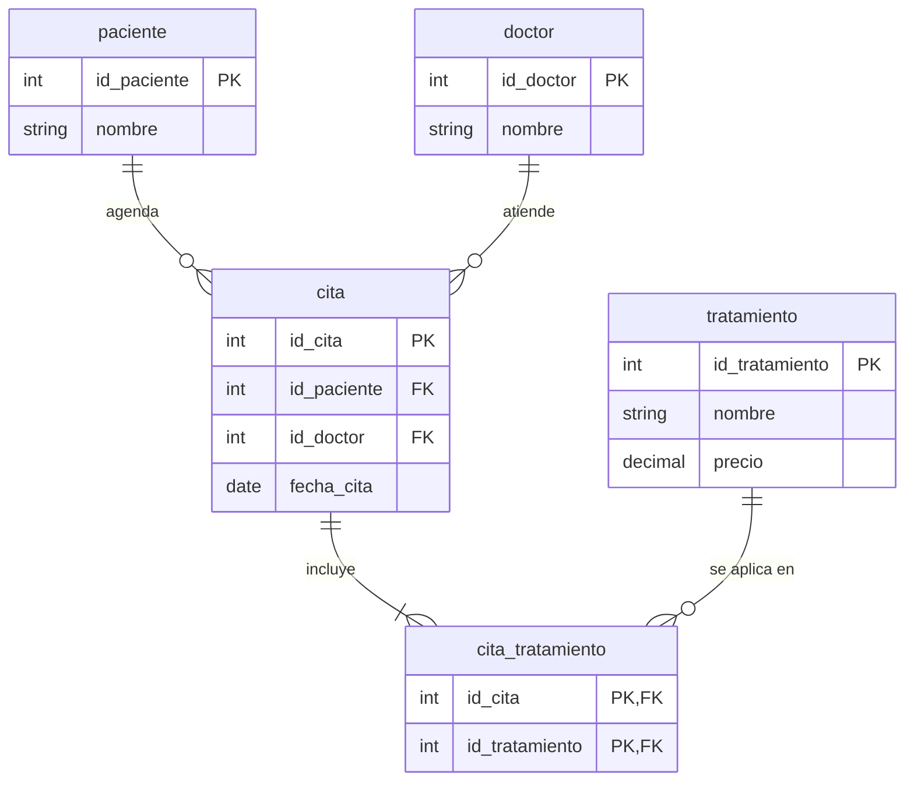

🌐 **Idiomas:** 🇺🇸 [English](README.md) | 🇪🇸 Español


# Cómo modelar correctamente bases de datos relacionales

Esta guía explica un método simple para diseñar bases de datos relacionales para **proyectos académicos y sistemas pequeños o medianos**.

El objetivo es evitar redundancia, mantener consistencia y producir estructuras de bases de datos limpias.

---

## Tabla de Contenidos

* [Algoritmo de los 6 Pasos](#algoritmo-de-los-6-pasos)
* [Ejemplo de Punta a Punta](#ejemplo-de-punta-a-punta)
* [Formas Normales](#formas-normales)
  * [Primera Forma Normal (1NF)](#primera-forma-normal-1nf)
  * [Segunda Forma Normal (2NF)](#segunda-forma-normal-2nf)
  * [Tercera Forma Normal (3NF)](#tercera-forma-normal-3nf)
  * [Más allá de 3NF](#más-allá-de-3nf)
* [Integridad Referencial](#integridad-referencial)
* [Errores Comunes en el Diseño de Bases de Datos](#errores-comunes-en-el-diseño-de-bases-de-datos)
* [Cuándo Desnormalizar](#cuándo-desnormalizar)
* [Checklist Final](#checklist-final)
* [Contribuir](#contribuir)

---

## Algoritmo de los 6 Pasos


```mermaid
flowchart TD

A[Paso 1: Entidades Fuertes] --> B[Paso 2: Entidades Débiles]
B --> C[Paso 3: Relaciones 1:1]
C --> D[Paso 4: Relaciones 1:M]
D --> E[Paso 5: Relaciones M:M]
E --> F[Paso 6: Transformación Final]

F --> G[Base de Datos Normalizada]
```

*Aplicar después del modelado Entidad-Relación (E-R).*

> **Nota sobre el diagrama E-R:** no incluyas llaves foráneas (FK) en el diagrama, porque las relaciones ya las representan. Sí es habitual subrayar el atributo identificador (PK) de cada entidad. Las FK aparecen hasta pasar al modelo relacional, a partir del Paso 3.

### Paso 1 – Entidades Fuertes

Crear una tabla por cada entidad fuerte, con sus atributos simples y su llave primaria.

### Paso 2 – Entidades Débiles

Crear una tabla por cada entidad débil. Su llave primaria se forma con la **llave primaria de la entidad propietaria + su discriminador** (el atributo que la distingue dentro de esa propietaria). La parte heredada también es una llave foránea.

A partir del Paso 3, las tablas comienzan a relacionarse entre sí y a recibir llaves foráneas.

### Paso 3 – Relaciones 1:1

Decidir qué tabla recibe la llave foránea. Criterio práctico: colocarla en la tabla con **participación total** (la que siempre debe tener la relación) o en la más dependiente de las dos.

La llave foránea debe llevar la restricción `UNIQUE`, para que la relación se mantenga 1:1.

### Paso 4 – Relaciones 1:M

La tabla del **lado muchos** recibe la llave foránea de la tabla del **lado uno**.

### Paso 5 – Relaciones M:M

Crear una nueva tabla intermedia que incluya la llave primaria de cada una de las tablas relacionadas.

- Su llave primaria es **compuesta** (`id_a` + `id_b`), y cada una de esas columnas es a la vez llave foránea.
- Los atributos propios de la relación (por ejemplo `fecha` o `cantidad`) se guardan en esta tabla.
- Es válido que contenga únicamente las dos llaves foráneas.

### Paso 6 – Transformación Final

Revisar y completar el modelo relacional:

- Convertir los atributos **multivaluados** en una tabla aparte, con FK hacia su entidad.
- Aplanar los atributos **compuestos** (por ejemplo, `direccion` → `calle`, `ciudad`, `codigo_postal`).
- No almacenar atributos **derivados** (por ejemplo, `edad`, que se calcula a partir de `fecha_nacimiento`).
- Definir tipos de dato y restricciones (`NOT NULL`, `UNIQUE`, `CHECK`, `DEFAULT`).
- Verificar 1NF, 2NF y 3NF (ver [Formas Normales](#formas-normales)).

> **Casos que este algoritmo no cubre directamente:** las relaciones **ternarias** (una tabla intermedia con tres llaves foráneas) y la **especialización/generalización** (subtipos). Para ellos se necesitan decisiones adicionales de diseño.

---

## Ejemplo de Punta a Punta

Una clínica dental: un paciente agenda citas, cada cita la atiende un doctor y en ella se aplican uno o más tratamientos.

Aplicando el algoritmo:

| Paso | Resultado |
| ---- | --------- |
| 1 | Tablas `paciente`, `doctor`, `tratamiento` |
| 4 | `cita` recibe `id_paciente` e `id_doctor` (una cita pertenece a un paciente y a un doctor) |
| 5 | `cita` y `tratamiento` son M:M, así que se crea `cita_tratamiento` |

Modelo relacional resultante:


```mermaid
erDiagram
    paciente ||--o{ cita : agenda
    doctor ||--o{ cita : atiende
    cita ||--|{ cita_tratamiento : incluye
    tratamiento ||--o{ cita_tratamiento : "se aplica en"

    paciente {
        int id_paciente PK
        string nombre
    }
    doctor {
        int id_doctor PK
        string nombre
    }
    tratamiento {
        int id_tratamiento PK
        string nombre
        decimal precio
    }
    cita {
        int id_cita PK
        int id_paciente FK
        int id_doctor FK
        date fecha_cita
    }
    cita_tratamiento {
        int id_cita PK, FK
        int id_tratamiento PK, FK
    }
```

Y en SQL (la sintaxis de autoincremento varía según el motor):

```sql
CREATE TABLE paciente (
    id_paciente INTEGER PRIMARY KEY,
    nombre      VARCHAR(100) NOT NULL
);

CREATE TABLE doctor (
    id_doctor INTEGER PRIMARY KEY,
    nombre    VARCHAR(100) NOT NULL
);

CREATE TABLE tratamiento (
    id_tratamiento INTEGER PRIMARY KEY,
    nombre         VARCHAR(100) NOT NULL,
    precio         DECIMAL(10,2) NOT NULL CHECK (precio >= 0)
);

CREATE TABLE cita (
    id_cita     INTEGER PRIMARY KEY,
    id_paciente INTEGER NOT NULL REFERENCES paciente (id_paciente),
    id_doctor   INTEGER NOT NULL REFERENCES doctor (id_doctor),
    fecha_cita  DATE NOT NULL
);

CREATE TABLE cita_tratamiento (
    id_cita        INTEGER NOT NULL REFERENCES cita (id_cita) ON DELETE CASCADE,
    id_tratamiento INTEGER NOT NULL REFERENCES tratamiento (id_tratamiento) ON DELETE RESTRICT,
    PRIMARY KEY (id_cita, id_tratamiento)
);

-- Índices en llaves foráneas usadas con frecuencia en consultas
CREATE INDEX idx_cita_paciente ON cita (id_paciente);
CREATE INDEX idx_cita_doctor   ON cita (id_doctor);
```

---

## Formas Normales

*Úsalas como lista de verificación final para validar el resultado del algoritmo. Si el algoritmo se aplicó con cuidado, normalmente el diseño ya cumple con ellas.*

### Primera Forma Normal (1NF)

Eliminar valores repetidos.

Cada columna debe almacenar **un solo valor** (valores atómicos).

Incorrecto:

| Fecha_Cita | Tratamientos                     |
| ---------- | -------------------------------- |
| 02/14/2024 | Ortodoncia, Limpieza, Endodoncia |

Correcto:

| Fecha_Cita | Tratamiento |
| ---------- | ----------- |
| 02/14/2024 | Ortodoncia  |
| 02/14/2024 | Limpieza    |
| 02/14/2024 | Endodoncia  |

---

### Segunda Forma Normal (2NF)

Requiere cumplir primero la 1NF.

Eliminar **dependencias parciales**: ocurren cuando la llave primaria es **compuesta** y un atributo depende solo de una parte de ella.

Incorrecto (llave primaria: `ID_Cita` + `ID_Tratamiento`):

| ID_Cita | ID_Tratamiento | Nombre_Tratamiento | Precio |
| ------- | -------------- | ------------------ | ------ |
| 1       | 7              | Ortodoncia         | 1500   |
| 2       | 7              | Ortodoncia         | 1500   |
| 2       | 21             | Limpieza           | 400    |

`Nombre_Tratamiento` y `Precio` dependen solo de `ID_Tratamiento`, no de la llave completa. Si el precio cambia, hay que actualizarlo en varias filas.

Correcto:

**Tratamiento**

| ID_Tratamiento | Nombre     | Precio |
| -------------- | ---------- | ------ |
| 7              | Ortodoncia | 1500   |
| 21             | Limpieza   | 400    |

**Cita_Tratamiento**

| ID_Cita | ID_Tratamiento |
| ------- | -------------- |
| 1       | 7              |
| 2       | 7              |
| 2       | 21             |

---

### Tercera Forma Normal (3NF)

Requiere cumplir primero la 2NF.

Eliminar **dependencias transitivas**: un atributo que no es clave no debe depender de otro atributo que tampoco es clave.

Una regla fácil de recordar: *"Cada atributo depende de la llave, de toda la llave y de nada más que la llave."*

Incorrecto:

| ID_Empleado | Nombre | ID_Departamento | Nombre_Departamento |
| ----------- | ------ | --------------- | ------------------- |
| 1           | Ana    | 10              | Ventas              |
| 2           | Luis   | 10              | Ventas              |

`Nombre_Departamento` depende de `ID_Departamento` (que no es la llave) y no directamente de `ID_Empleado`.

Correcto:

**Empleado**

| ID_Empleado | Nombre | ID_Departamento |
| ----------- | ------ | --------------- |
| 1           | Ana    | 10              |
| 2           | Luis   | 10              |

**Departamento**

| ID_Departamento | Nombre |
| --------------- | ------ |
| 10              | Ventas |

---

### Más allá de 3NF

- **BCNF (Boyce-Codd):** versión más estricta de la 3NF. Exige que todo determinante sea una llave candidata.
- **4NF y 5NF:** aplican en casos más complejos que involucran dependencias multivaluadas o dependencias de unión.

Para la mayoría de los sistemas, llegar a **3NF es suficiente para obtener una base de datos bien diseñada**.

---

## Integridad Referencial

Una llave foránea garantiza que no existan referencias a filas inexistentes. Además, permite definir qué sucede al borrar o actualizar la fila referenciada:

| Opción | Comportamiento | Ejemplo de uso |
| ------ | -------------- | -------------- |
| `RESTRICT` / `NO ACTION` | Impide borrar la fila padre mientras tenga hijos | No borrar un tratamiento que ya se usó en citas |
| `CASCADE` | Borra (o actualiza) también las filas hijas | Al borrar una cita, borrar sus filas de `cita_tratamiento` |
| `SET NULL` | Pone la FK en `NULL` en las filas hijas | Conservar la cita aunque se elimine al doctor (la columna debe permitir `NULL`) |

Elige la opción según las reglas del negocio y no uses `CASCADE` por costumbre: puede borrar más datos de los esperados.

---

## Errores Comunes en el Diseño de Bases de Datos

### 1. Usar nombres vagos o inconsistentes

Mal:

```text
UserTable
tbl_users
users_data
User
Products
orders
```

Bien:

```text
usuario
producto
pedido
```

Las tablas y columnas deben seguir **convenciones de nombres consistentes** (por ejemplo, `snake_case` en minúsculas, un solo idioma y un patrón fijo para las llaves como `id_paciente`).

Preferiblemente, utiliza **nombres en singular** para las tablas, ya que cada fila (tupla) representa una instancia de esa entidad. Si decides utilizar plural, también es válido, pero **debe mantenerse la misma convención en toda la base de datos**.

> Lo importante no es tanto elegir singular o plural, sino mantener una convención consistente.

---

### 2. Usar palabras reservadas como nombres

Palabras como `user`, `order`, `group` o `table` son reservadas en varios motores (por ejemplo, `user` y `order` en PostgreSQL y MySQL) y obligan a escaparlas con comillas. Usa nombres como `usuario` y `pedido`, o `app_user` y `customer_order`.

---

### 3. Usar datos naturales como llaves primarias

Incorrecto:

Usar el email como llave primaria.

Correcto:

`id_usuario` (llave primaria entera) y `email` con restricción `UNIQUE`.

Los datos naturales pueden cambiar, pero los IDs permanecen estables. El dato natural sigue siendo útil: simplemente se protege con `UNIQUE` en lugar de usarlo como PK.

---

### 4. Mezclar múltiples entidades en una sola tabla

Cada tabla debe representar claramente un concepto del dominio o, cuando corresponda, una relación entre conceptos.

El problema aparece cuando una misma tabla intenta almacenar los datos propios de varias entidades independientes.

Por ejemplo:

| employee_id | employee_name | customer_id | customer_name |
| ----------- | ------------- | ----------- | ------------- |
| 1           | Ana           | 100         | Pedro         |
| 1           | Ana           | 101         | María         |

Esta tabla mezcla los datos de `employee` y `customer`. Esto provoca redundancia (Ana se repite), anomalías de actualización y dificultades para mantener la integridad de los datos.

---

### 5. Diseñar tablas sin entender primero el dominio

Una base de datos no debería diseñarse solamente a partir del código de la aplicación.

Primero se debe entender:

- entidades
- relaciones
- restricciones

Después se crean las tablas.

---

### 6. Ignorar consideraciones de indexación

Incluso tablas bien diseñadas pueden volverse lentas sin índices adecuados.

- La llave primaria normalmente ya se indexa de forma automática.
- Lo que suele faltar son los índices en las **llaves foráneas** y en las columnas que se filtran u ordenan con frecuencia.
- No indexes todo: cada índice ocupa espacio y hace más lentas las escrituras.

---

### 7. Usar `NULL` o texto separado por comas para representar "varios valores"

Si un dato puede tener varios valores, necesita su propia tabla (ver 1NF y el Paso 6). Guardar `"a, b, c"` en una columna o crear `telefono1`, `telefono2`, `telefono3` dificulta las consultas y rompe la normalización.

---

## Cuándo Desnormalizar

La normalización prioriza la consistencia, pero no es una regla absoluta. A veces se duplican datos de forma **consciente** para mejorar el rendimiento de lecturas o simplificar reportes.

Si lo haces:

- Hazlo solo después de medir un problema real de rendimiento.
- Documenta qué datos se duplican y por qué.
- Define cómo se mantendrá la consistencia (triggers, procesos programados o lógica de la aplicación).

---

## Checklist Final

Antes de dar por terminado el diseño, verifica:

- [ ] Cada tabla representa un solo concepto del dominio.
- [ ] Toda tabla tiene llave primaria estable (preferiblemente un ID, no un dato natural).
- [ ] No hay columnas con múltiples valores (1NF).
- [ ] No hay dependencias parciales ni transitivas (2NF y 3NF).
- [ ] Las relaciones M:M tienen su tabla intermedia con llave primaria compuesta.
- [ ] Las llaves foráneas están definidas, con su comportamiento `ON DELETE` elegido a propósito.
- [ ] Los datos que deben ser únicos tienen `UNIQUE`, y los obligatorios, `NOT NULL`.
- [ ] Los nombres siguen una convención consistente y no usan palabras reservadas.
- [ ] Las llaves foráneas y columnas de consulta frecuente están indexadas.

---

## Contribuir

Las contribuciones son bienvenidas.

Si encuentras errores, mejoras o ejemplos mejores,
puedes abrir un Issue o enviar un Pull Request.
