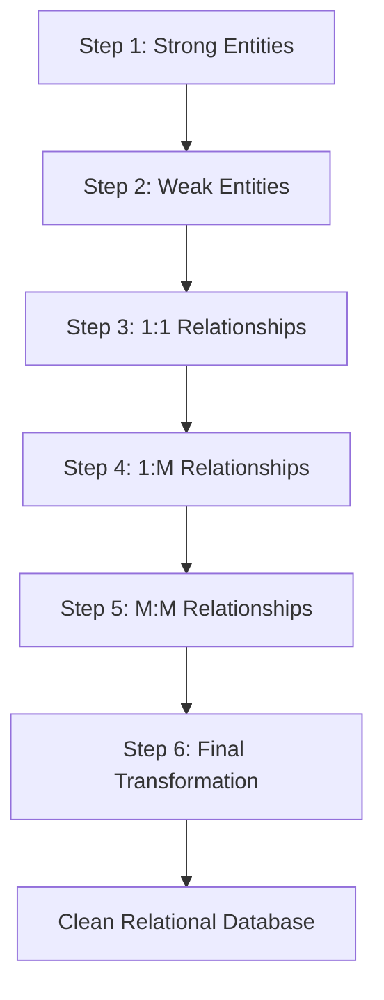

🌐 **Languages:** 🇺🇸 English | 🇪🇸 [Español](README.es.md)


# How to Model Relational Databases Correctly

This guide explains a simple method to design relational databases for **academic projects and small-to-medium systems**.

The goal is to avoid redundancy, maintain consistency, and produce clean database structures.

This document was originally created for a **database design competition at university**.

---

---

## Table of Contents

- [Six-Step Algorithm](#six-step-algorithm)
- [Normal Forms](#normal-forms)
  - [First Normal Form (1NF)](#first-normal-form-1nf)
  - [Second Normal Form (2NF)](#second-normal-form-2nf)
  - [Third Normal Form (3NF)](#third-normal-form-3nf)
- [Common Database Design Mistakes](#common-database-design-mistakes)
- [Contributing](#contributing)

---

# Six-Step Algorithm
*Apply after Entity-Relationship modeling.*



### Step 1 – Strong Entities
Create tables for all strong entities.

### Step 2 – Weak Entities
Create tables for weak entities that depend on their owner entity.

From step 3 onward, tables begin to relate with each other and receive foreign keys.

**NOTE:** Never mark PK or FK in the ER diagram.

### Step 3 – 1:1 Relationships
Analyze which table should contain the foreign key.

### Step 4 – 1:M Relationships
The table on the **many side** receives the foreign key of the **one side**.

### Step 5 – M:M Relationships
Create a new table that includes the primary key of each related table.

It is valid for this table to contain only the two foreign keys.

### Step 6 – Final Transformation
At this point the tables should be correctly related.

If the algorithm was applied properly, the database should avoid redundancy and unnecessary complexity while keeping data consistent.

---

# Normal Forms
*Not necessary if the algorithm has already been applied.*

## First Normal Form (1NF)
Remove repeating values.

Each column should store **a single value**.

Incorrect:

| Fecha_Cita | Tratamientos |
|------------|--------------|
| 02/14/2024 | Ortodoncia, Limpieza, Endodoncia |

Correct:

| Fecha_Cita | Tratamientos |
|------------|--------------|
| 02/14/2024 | Ortodoncia |
| 02/14/2024 | Limpieza |
| 02/14/2024 | Endodoncia |

---

## Second Normal Form (2NF)
Requires 1NF.

Remove partial dependencies.

From a memory and design perspective, it is better to store **foreign keys with IDs instead of descriptions**.

Incorrect:

| ID_Cita | Paciente | Doctor | Fecha_Cita | Tratamiento |
|--------|---------|-------|-----------|-------------|
| 1 | Fernando Flores | Dr. López | 02/14/2024 | Ortodoncia |
| 2 | Ash Ketchum | Dr. López | 04/15/2025 | Blanqueamiento |
| 3 | Charmander Sánchez | Dr. Villa | 01/05/2023 | Endodoncia |

Correct:

| ID_Cita | Id_Paciente | Id_Doctor | Fecha_Cita | Id_Tratamiento |
|--------|-------------|----------|------------|---------------|
| 1 | 3 | 2 | 02/14/2024 | 7 |
| 2 | 6 | 2 | 02/14/2024 | 21 |
| 3 | 10 | 15 | 02/14/2024 | 2 |

---

## Third Normal Form (3NF)

A non-key attribute must not depend on another non-key attribute.

Attributes should depend **only on the primary key**.

Correct:

| EstudianteID | CursoID |
|--------------|--------|
| 1 | C1 |
| 2 | C2 |

Incorrect:

| EstudianteID | CursoID | Profesor |
|--------------|--------|---------|
| 1 | C1 | López |
| 2 | C2 | Ramírez |

This breaks 3NF because **Profesor depends on Curso rather than Estudiante**.

---

Fourth and fifth normal forms apply to complex cases involving multivalued dependencies or join dependencies.

For most systems, reaching **3NF is sufficient to produce a well-designed database**.

---

---

# Common Database Design Mistakes

## 1. Using vague or inconsistent naming

Bad:

UserTable
tbl_users
users_data

Good:

Users
Orders
Products

Tables and columns should follow **consistent naming conventions**.

---

## 2. Use singular or plural names inconsistently

Bad:

```text
User
Products
orders
```

Good:

```text
User
Product
Order
```

Preferably, use **singular names** for tables, since each row (tuple) represents an instance of that entity.

Using plural names is also valid, but **the same convention should be followed consistently throughout the entire database**.

> What matters most is not whether you choose singular or plural, but maintaining a consistent naming convention.

---

## 3. Using natural data as primary keys

Incorrect:

Email as primary key

Correct:

UserID (integer primary key)

Natural data can change, but IDs remain stable.

---

## 4. Creating tables that try to represent multiple entities

Example:

EmployeeCustomer

This indicates two different entities were mixed into one table.

Entities should represent **one real-world concept**.

---

## 5. Designing tables before understanding the domain

A database should not be designed only from the application code.

First understand:

• entities  
• relationships  
• constraints  

Then create tables.

---

## 6. Ignoring indexing considerations

Even well designed tables can become slow without proper indexes.

Primary keys and frequently searched fields should be indexed.

# Contributing

Contributions are welcome.

If you find mistakes, improvements, or better examples,
please open an Issue or submit a Pull Request.
