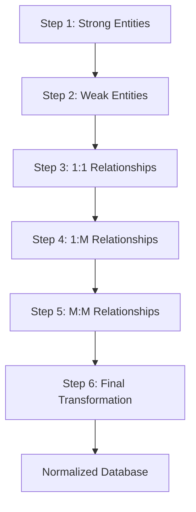
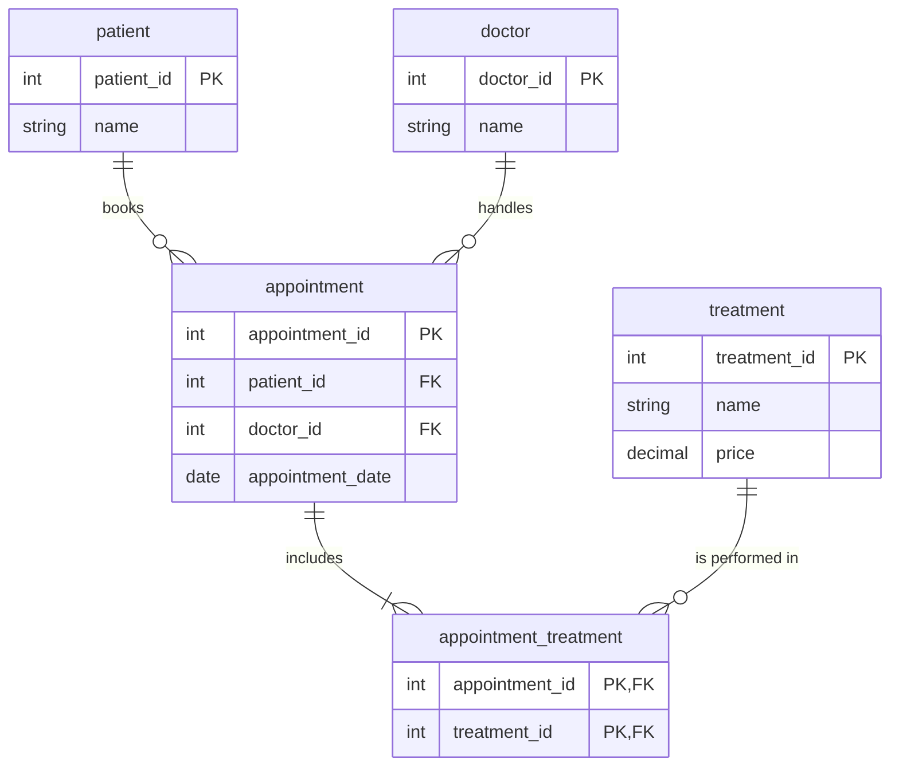

🌐 **Languages:** 🇺🇸 English | 🇪🇸 [Español](README.es.md)


# How to Properly Model Relational Databases

This guide explains a simple method for designing relational databases for **academic projects and small to medium-sized systems**.

The goal is to avoid redundancy, keep data consistent and produce clean database structures.

---

## Table of Contents

* [The 6-Step Algorithm](#the-6-step-algorithm)
* [End-to-End Example](#end-to-end-example)
* [Normal Forms](#normal-forms)
  * [First Normal Form (1NF)](#first-normal-form-1nf)
  * [Second Normal Form (2NF)](#second-normal-form-2nf)
  * [Third Normal Form (3NF)](#third-normal-form-3nf)
  * [Beyond 3NF](#beyond-3nf)
* [Referential Integrity](#referential-integrity)
* [Common Database Design Mistakes](#common-database-design-mistakes)
* [When to Denormalize](#when-to-denormalize)
* [Final Checklist](#final-checklist)
* [Contributing](#contributing)

---

## The 6-Step Algorithm


```mermaid
flowchart TD

A[Step 1: Strong Entities] --> B[Step 2: Weak Entities]
B --> C[Step 3: 1:1 Relationships]
C --> D[Step 4: 1:M Relationships]
D --> E[Step 5: M:M Relationships]
E --> F[Step 6: Final Transformation]

F --> G[Normalized Database]
```

*Apply after Entity-Relationship (E-R) modeling.*

> **Note on the E-R diagram:** do not include foreign keys (FKs) in the diagram, since the relationships already represent them. It is common, however, to underline each entity's identifying attribute (PK). FKs only appear once you move to the relational model, starting at Step 3.

### Step 1 – Strong Entities

Create one table for each strong entity, with its simple attributes and its primary key.

### Step 2 – Weak Entities

Create one table for each weak entity. Its primary key is made of the **owner entity's primary key + its own discriminator** (the attribute that tells it apart within that owner). The inherited part is also a foreign key.

Starting at Step 3, tables begin to relate to each other and receive foreign keys.

### Step 3 – 1:1 Relationships

Decide which table receives the foreign key. A practical rule: place it in the table with **total participation** (the one that must always have the relationship) or in the more dependent of the two.

The foreign key must have a `UNIQUE` constraint so the relationship stays 1:1.

### Step 4 – 1:M Relationships

The table on the **many side** receives the foreign key from the table on the **one side**.

### Step 5 – M:M Relationships

Create a new junction table that includes the primary key of each related table.

- Its primary key is **composite** (`a_id` + `b_id`), and each of those columns is also a foreign key.
- Attributes that belong to the relationship itself (for example `date` or `quantity`) are stored in this table.
- It is valid for the table to contain only the two foreign keys.

### Step 6 – Final Transformation

Review and complete the relational model:

- Turn **multivalued** attributes into a separate table, with an FK to their entity.
- Flatten **composite** attributes (for example, `address` → `street`, `city`, `postal_code`).
- Do not store **derived** attributes (for example, `age`, which is computed from `birth_date`).
- Define data types and constraints (`NOT NULL`, `UNIQUE`, `CHECK`, `DEFAULT`).
- Verify 1NF, 2NF and 3NF (see [Normal Forms](#normal-forms)).

> **Cases this algorithm does not cover directly:** **ternary** relationships (a junction table with three foreign keys) and **specialization/generalization** (subtypes). These require additional design decisions.

---

## End-to-End Example

A dental clinic: a patient books appointments, each appointment is handled by a doctor, and one or more treatments are performed during it.

Applying the algorithm:

| Step | Result |
| ---- | ------ |
| 1 | Tables `patient`, `doctor`, `treatment` |
| 4 | `appointment` receives `patient_id` and `doctor_id` (an appointment belongs to one patient and one doctor) |
| 5 | `appointment` and `treatment` are M:M, so `appointment_treatment` is created |

Resulting relational model:


```mermaid
erDiagram
    patient ||--o{ appointment : books
    doctor ||--o{ appointment : handles
    appointment ||--|{ appointment_treatment : includes
    treatment ||--o{ appointment_treatment : "is performed in"

    patient {
        int patient_id PK
        string name
    }
    doctor {
        int doctor_id PK
        string name
    }
    treatment {
        int treatment_id PK
        string name
        decimal price
    }
    appointment {
        int appointment_id PK
        int patient_id FK
        int doctor_id FK
        date appointment_date
    }
    appointment_treatment {
        int appointment_id PK, FK
        int treatment_id PK, FK
    }
```

And in SQL (auto-increment syntax varies by engine):

```sql
CREATE TABLE patient (
    patient_id INTEGER PRIMARY KEY,
    name       VARCHAR(100) NOT NULL
);

CREATE TABLE doctor (
    doctor_id INTEGER PRIMARY KEY,
    name      VARCHAR(100) NOT NULL
);

CREATE TABLE treatment (
    treatment_id INTEGER PRIMARY KEY,
    name         VARCHAR(100) NOT NULL,
    price        DECIMAL(10,2) NOT NULL CHECK (price >= 0)
);

CREATE TABLE appointment (
    appointment_id   INTEGER PRIMARY KEY,
    patient_id       INTEGER NOT NULL REFERENCES patient (patient_id),
    doctor_id        INTEGER NOT NULL REFERENCES doctor (doctor_id),
    appointment_date DATE NOT NULL
);

CREATE TABLE appointment_treatment (
    appointment_id INTEGER NOT NULL REFERENCES appointment (appointment_id) ON DELETE CASCADE,
    treatment_id   INTEGER NOT NULL REFERENCES treatment (treatment_id) ON DELETE RESTRICT,
    PRIMARY KEY (appointment_id, treatment_id)
);

-- Indexes on foreign keys frequently used in queries
CREATE INDEX idx_appointment_patient ON appointment (patient_id);
CREATE INDEX idx_appointment_doctor  ON appointment (doctor_id);
```

---

## Normal Forms

*Use them as a final checklist to validate the result of the algorithm. If the algorithm was applied carefully, the design usually already satisfies them.*

### First Normal Form (1NF)

Eliminate repeated values.

Each column must store **a single value** (atomic values).

Incorrect:

| Appointment_Date | Treatments                          |
| ---------------- | ----------------------------------- |
| 02/14/2024       | Orthodontics, Cleaning, Root canal  |

Correct:

| Appointment_Date | Treatment    |
| ---------------- | ------------ |
| 02/14/2024       | Orthodontics |
| 02/14/2024       | Cleaning     |
| 02/14/2024       | Root canal   |

---

### Second Normal Form (2NF)

Requires 1NF first.

Eliminate **partial dependencies**: they occur when the primary key is **composite** and an attribute depends on only part of it.

Incorrect (primary key: `Appointment_ID` + `Treatment_ID`):

| Appointment_ID | Treatment_ID | Treatment_Name | Price |
| -------------- | ------------ | -------------- | ----- |
| 1              | 7            | Orthodontics   | 1500  |
| 2              | 7            | Orthodontics   | 1500  |
| 2              | 21           | Cleaning       | 400   |

`Treatment_Name` and `Price` depend only on `Treatment_ID`, not on the whole key. If the price changes, it has to be updated in several rows.

Correct:

**Treatment**

| Treatment_ID | Name         | Price |
| ------------ | ------------ | ----- |
| 7            | Orthodontics | 1500  |
| 21           | Cleaning     | 400   |

**Appointment_Treatment**

| Appointment_ID | Treatment_ID |
| -------------- | ------------ |
| 1              | 7            |
| 2              | 7            |
| 2              | 21           |

---

### Third Normal Form (3NF)

Requires 2NF first.

Eliminate **transitive dependencies**: a non-key attribute must not depend on another non-key attribute.

An easy rule to remember: *"Every attribute depends on the key, the whole key, and nothing but the key."*

Incorrect:

| Employee_ID | Name | Department_ID | Department_Name |
| ----------- | ---- | ------------- | --------------- |
| 1           | Ana  | 10            | Sales           |
| 2           | Luis | 10            | Sales           |

`Department_Name` depends on `Department_ID` (which is not the key) and not directly on `Employee_ID`.

Correct:

**Employee**

| Employee_ID | Name | Department_ID |
| ----------- | ---- | ------------- |
| 1           | Ana  | 10            |
| 2           | Luis | 10            |

**Department**

| Department_ID | Name  |
| ------------- | ----- |
| 10            | Sales |

---

### Beyond 3NF

- **BCNF (Boyce-Codd):** a stricter version of 3NF. It requires every determinant to be a candidate key.
- **4NF and 5NF:** apply to more complex cases involving multivalued dependencies or join dependencies.

For most systems, reaching **3NF is enough to get a well-designed database**.

---

## Referential Integrity

A foreign key guarantees there are no references to nonexistent rows. It also lets you define what happens when the referenced row is deleted or updated:

| Option | Behavior | Example use |
| ------ | -------- | ----------- |
| `RESTRICT` / `NO ACTION` | Prevents deleting the parent row while it has children | Don't delete a treatment already used in appointments |
| `CASCADE` | Also deletes (or updates) the child rows | When deleting an appointment, delete its `appointment_treatment` rows |
| `SET NULL` | Sets the FK to `NULL` in the child rows | Keep the appointment even if the doctor is removed (the column must allow `NULL`) |

Choose the option according to the business rules, and don't use `CASCADE` out of habit: it can delete more data than expected.

---

## Common Database Design Mistakes

### 1. Using vague or inconsistent names

Bad:

```text
UserTable
tbl_users
users_data
User
Products
orders
```

Good:

```text
app_user
product
customer_order
```

Tables and columns should follow **consistent naming conventions** (for example, lowercase `snake_case`, a single language and a fixed pattern for keys such as `patient_id`).

Preferably, use **singular names** for tables, since each row (tuple) represents one instance of that entity. Using plural names is also valid, but **the same convention must be kept across the whole database**.

> What matters is not so much choosing singular or plural, but keeping a consistent convention.

---

### 2. Using reserved words as names

Words such as `user`, `order`, `group` or `table` are reserved in several engines (for example, `user` and `order` in PostgreSQL and MySQL) and force you to escape them with quotes. Use names like `app_user` and `customer_order` instead.

---

### 3. Using natural data as primary keys

Incorrect:

Using the email as the primary key.

Correct:

`user_id` (integer primary key) and `email` with a `UNIQUE` constraint.

Natural data can change, but IDs stay stable. The natural data is still useful: it is simply protected with `UNIQUE` instead of being used as the PK.

---

### 4. Mixing multiple entities in a single table

Each table should clearly represent one domain concept or, when appropriate, a relationship between concepts.

The problem appears when a single table tries to store the data of several independent entities.

For example:

| employee_id | employee_name | customer_id | customer_name |
| ----------- | ------------- | ----------- | ------------- |
| 1           | Ana           | 100         | Pedro         |
| 1           | Ana           | 101         | María         |

This table mixes `employee` and `customer` data. This causes redundancy (Ana is repeated), update anomalies and difficulty maintaining data integrity.

---

### 5. Designing tables without understanding the domain first

A database should not be designed solely from the application code.

First, understand:

- entities
- relationships
- constraints

Then create the tables.

---

### 6. Ignoring indexing considerations

Even well-designed tables can become slow without proper indexes.

- The primary key is normally indexed automatically.
- What is usually missing are indexes on **foreign keys** and on columns that are frequently filtered or sorted.
- Don't index everything: every index takes up space and slows down writes.

---

### 7. Using `NULL` or comma-separated text to represent "multiple values"

If a piece of data can have several values, it needs its own table (see 1NF and Step 6). Storing `"a, b, c"` in one column or creating `phone1`, `phone2`, `phone3` makes queries harder and breaks normalization.

---

## When to Denormalize

Normalization prioritizes consistency, but it is not an absolute rule. Sometimes data is duplicated **deliberately** to improve read performance or simplify reports.

If you do it:

- Do it only after measuring a real performance problem.
- Document which data is duplicated and why.
- Define how consistency will be maintained (triggers, scheduled jobs or application logic).

---

## Final Checklist

Before considering the design finished, verify:

- [ ] Each table represents a single domain concept.
- [ ] Every table has a stable primary key (preferably an ID, not natural data).
- [ ] There are no columns with multiple values (1NF).
- [ ] There are no partial or transitive dependencies (2NF and 3NF).
- [ ] M:M relationships have their junction table with a composite primary key.
- [ ] Foreign keys are defined, with their `ON DELETE` behavior chosen on purpose.
- [ ] Data that must be unique has `UNIQUE`, and required data has `NOT NULL`.
- [ ] Names follow a consistent convention and don't use reserved words.
- [ ] Foreign keys and frequently queried columns are indexed.

---

## Contributing

Contributions are welcome.

If you find errors, improvements or better examples,
you can open an Issue or submit a Pull Request.
